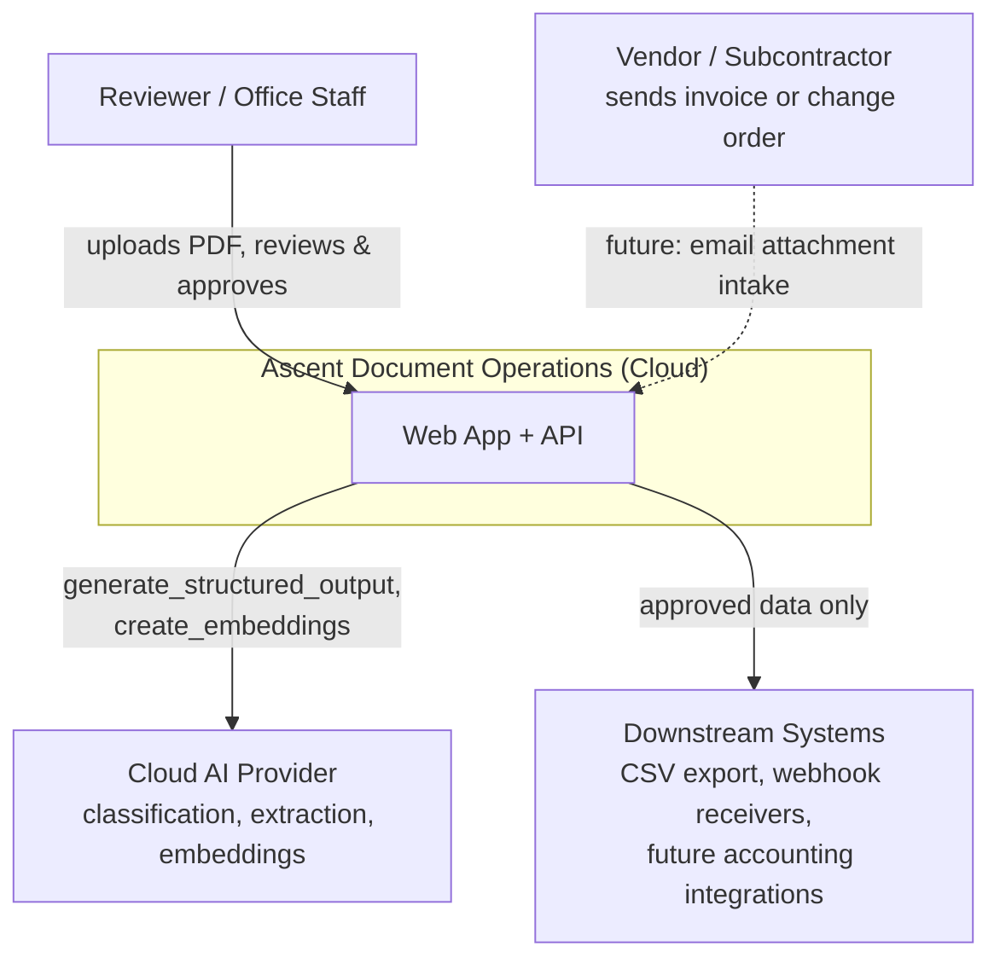
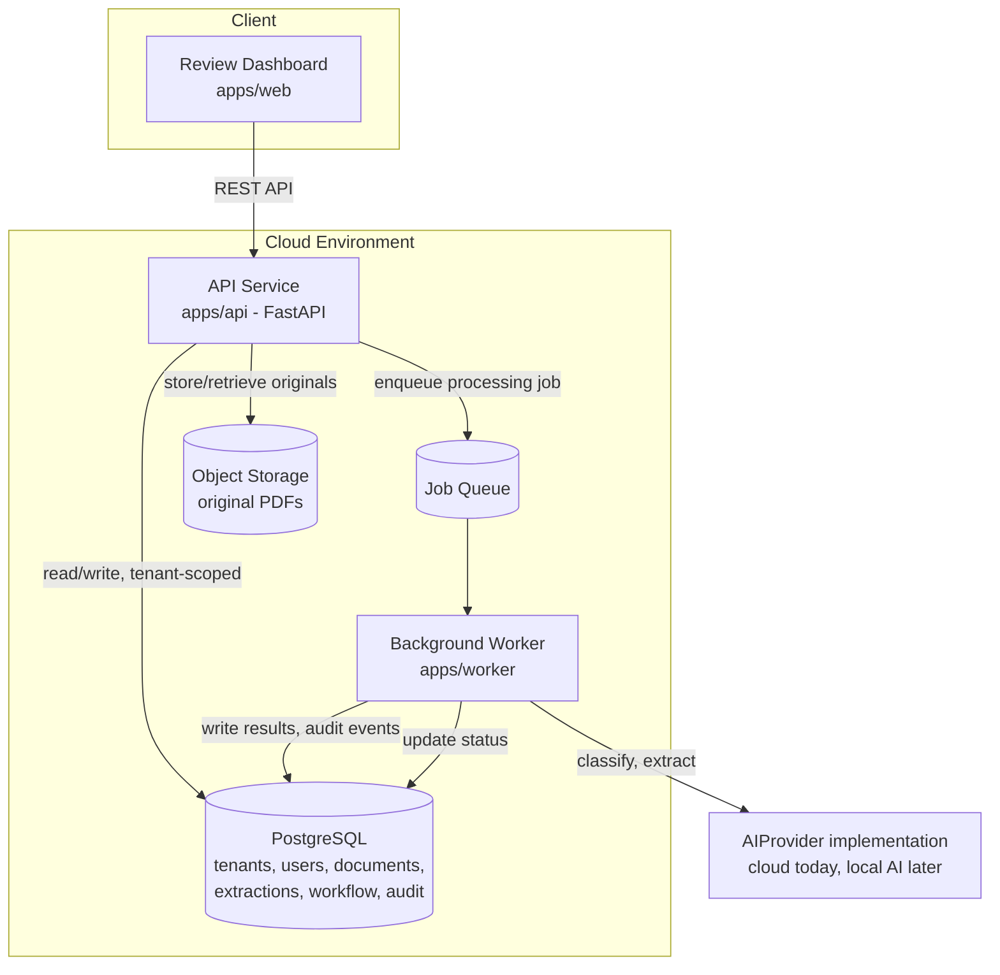

# System Architecture — Ascent Document Operations

> Draft v0.1. Describes the cloud-first MVP architecture and where the
> future local AI worker fits. Detailed database design is TASK-005;
> detailed local AI migration steps are TASK-013
> (`docs/architecture/local-ai-migration-plan.md` covers the high-level
> role only, per this task's scope).

## System boundaries

**In the cloud, permanently** (per master plan §4): the public web
application, customer dashboard, public API, authentication/authorization,
PostgreSQL, object storage, background-job queue, workflow state, audit
records, monitoring/logging, webhook delivery, email intake, customer
configuration.

**Cloud AI initially, local AI later**: document classification, extraction,
structured JSON generation, summarization, draft responses, embeddings, and
document search all go through the `AIProvider` protocol. The MVP only
implements a cloud provider; a future local AI provider is a drop-in
implementation of the same protocol, not a parallel system.

**Never on the local AI worker**: the public application, authentication,
the database, or any customer-facing service. It is a private inference
worker only — see "Future local AI role" below and
[ADR-0002](decisions/0002-local-ai-private-inference-worker.md).

## System context diagram

## Container diagram

## Future local AI role

A future local AI server will act as a private inference worker, reachable
from the cloud over a secure tunnel/VPN. It implements the same
`AIProvider` protocol as the cloud provider, so the worker code that calls
`generate_structured_output` / `generate_text` / `create_embeddings` does
not change when the provider changes — only configuration/routing does.

Planned responsibilities once migrated (subset, chosen per master plan §4):
classification, structured extraction, embedding creation, summarization,
batch evaluation. Cloud fallback stays available so a local AI outage
degrades to cloud inference rather than blocking processing entirely.

This document intentionally stops at the architectural boundary — detailed
networking, authentication between cloud and the local worker, and rollout
steps are TASK-013's job, once the cloud MVP is proven end to end.

## Architecture decision records

See `docs/architecture/decisions/`. Started with this task:

- [ADR-0001: Cloud-first architecture](decisions/0001-cloud-first-architecture.md)
- [ADR-0002: Local AI as a private inference worker](decisions/0002-local-ai-private-inference-worker.md)

More will be added as decisions are made (master plan §13 lists the full
required set: FastAPI, PostgreSQL, object storage, background-job queue,
tenant isolation, AI provider abstraction, human approval, cloud fallback,
GitHub duplicate prevention).